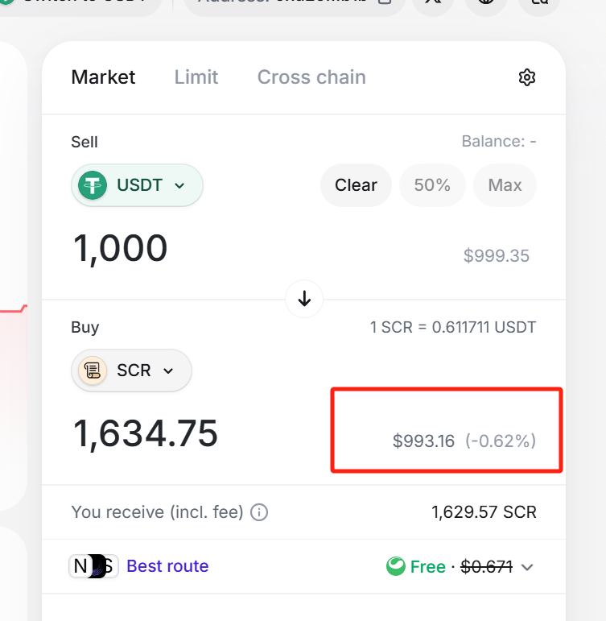
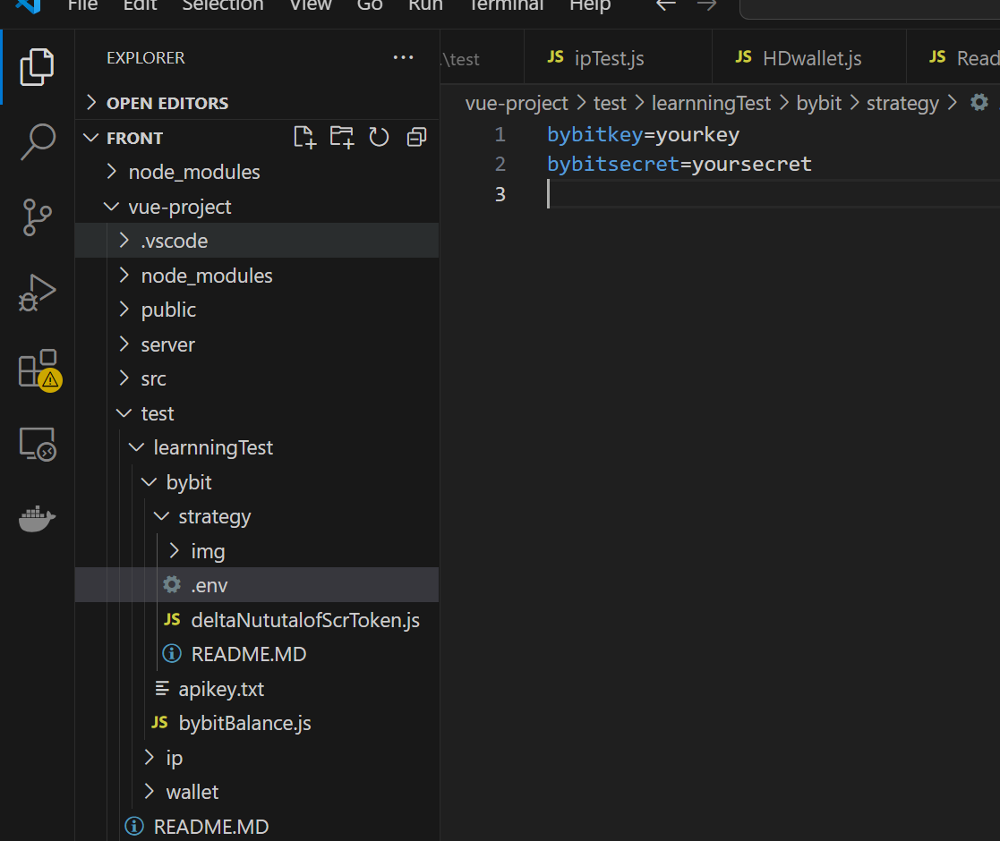
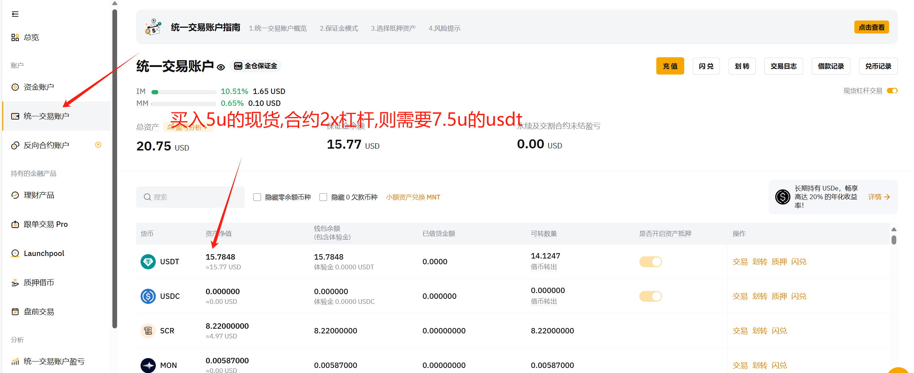
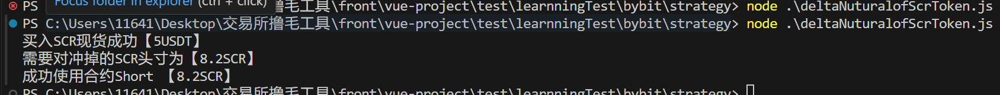
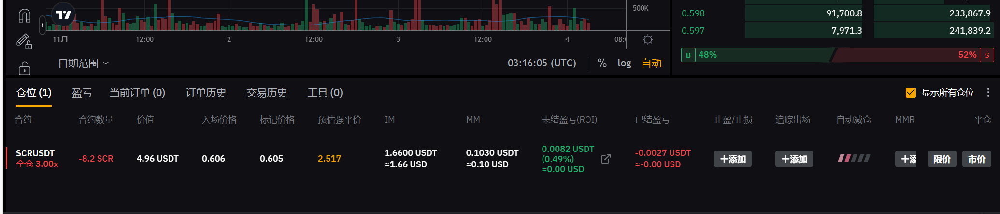
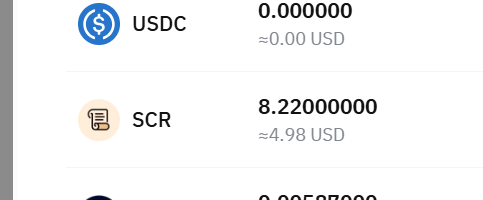

# 交易费用损耗

1. [现货吃单和挂单都为千分之一的费用](https://www.bybit.com/zh-MY/my-fee-rate)
2. [match](https://matcha.xyz/tokens/scroll/0xd29687c813d741e2f938f4ac377128810e217b1b?sellChain=534352&sellAddress=0xf55bec9cafdbe8730f096aa55dad6d22d44099df&sellAmount=1000) 交易所手续费为千四到千六
3. Bybit提现手续费固定0.5SCR(0.3u左右)




# 套利步骤

1.使用api进行下单套保(市价买入现货,同时开出同等头寸的空头合约,为了降低开仓现货和合约之间时间带来的价差所以使用脚本同时下单)

2.将SCR提现到SCR网络当中

3.盯价差,Match中卖出SCR现货,bybit中买入SCR现货（保证卖出SCR获得的u比买入SCR花费的u多）

4.继续盯价差,和步骤三相反,Match 中买入SCR现货,bybit中卖出SCR现货(保证卖出SCR获得的u比买入SCR花费的u多)

# 脚本使用

1.在[bybit api管理中心](https://www.bybit.com/app/user/api-management)导出apikey和secret,并授权合约和现货交易权限

2.在当前目录下的.env环境中填入bybitapikey和bybitsecret



3.在deltaNuturalofScrToken.js的main函数当中修改需要买入SCR现货的头寸


4.运行命令

> 使用脚本之前保证账户的交易账户中有足够的USDT,使用脚本完成操作之后在交易所中查看套保是否成功,如果只买入了现货或者开了合约记得手动去平了或者完成没有完成的另外一步否则会导致资金损失




```
node .\deltaNuturalofScrToken.js
```

脚本运行效果







# 总结

这个套利需要足够大的波动带来价差,交易的损耗大概为千分七,所以差价达到百分之一左右才有利可图需要在一些特定的时机下进行.如果验证了这个套利逻辑可行,可以把套保的后续流程也写成脚本.


